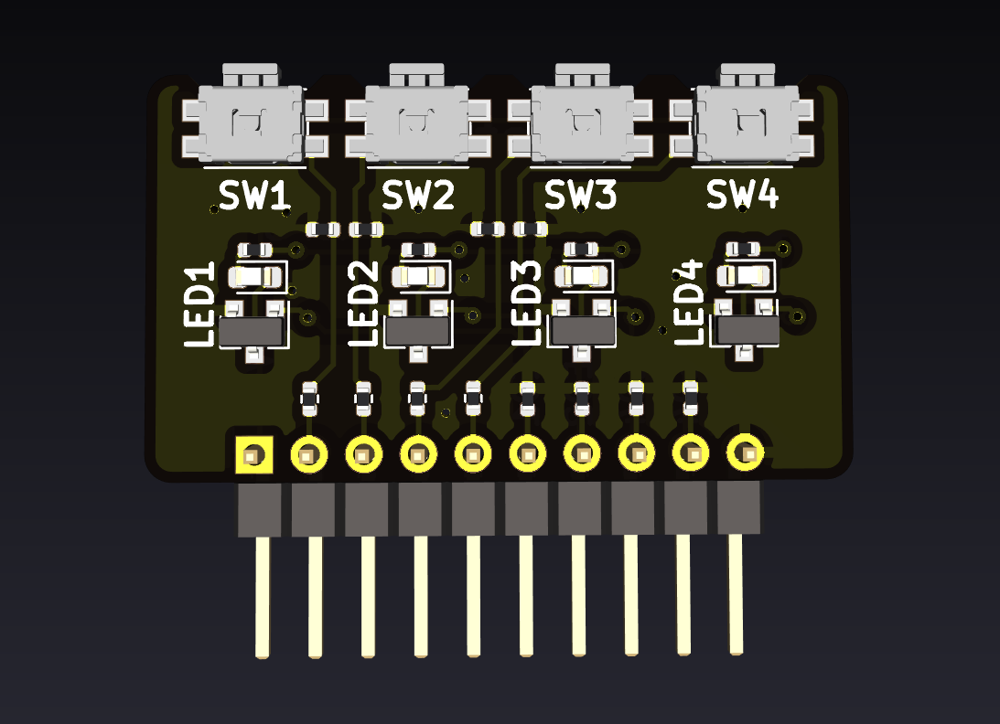

# breadboard-io

breadboard-io makes it easy to connect 4 LEDs and 4 push-buttons to a broadboard (All signals are active high controls). Provide VCC, GND and your signal wires to other circuitry or microcontroller and you're ready to go. The getting started guide and hardware documentation for this board is available at [greatlakesdev.io](https://greatlakesdev.io). If you'd like to build one yourself, the latest Gerber files and schematics can be found in the [Release](https://github.com/greatlakesdev/breadboard-io/releases) section on Github.

